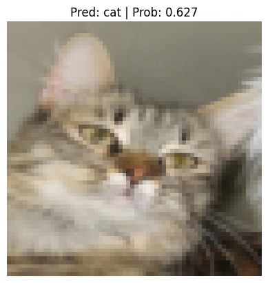

# pytorch-cat-vs-human
Classifying cat and human using pytorch

## Screenshots
</image> 

</image>

</image> 

## Contributions

Contributions are welcome! If you find a bug or have an enhancement in mind, feel free to open an issue or submit a pull request.

## Donate 

